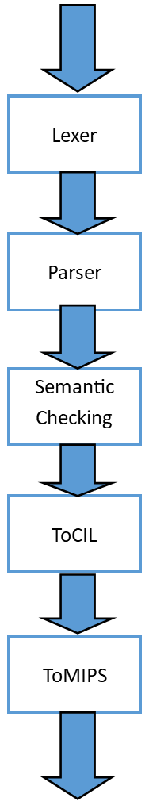
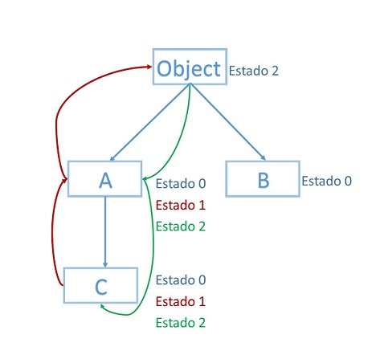
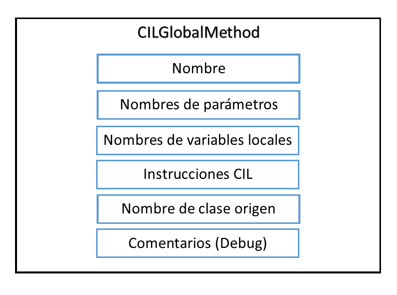
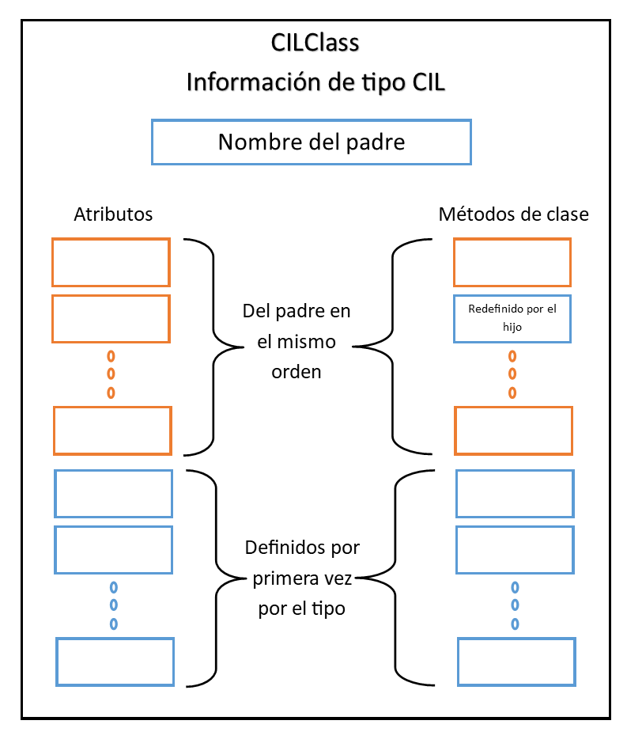
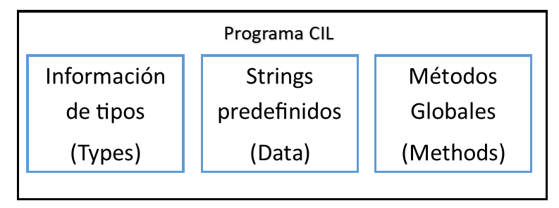
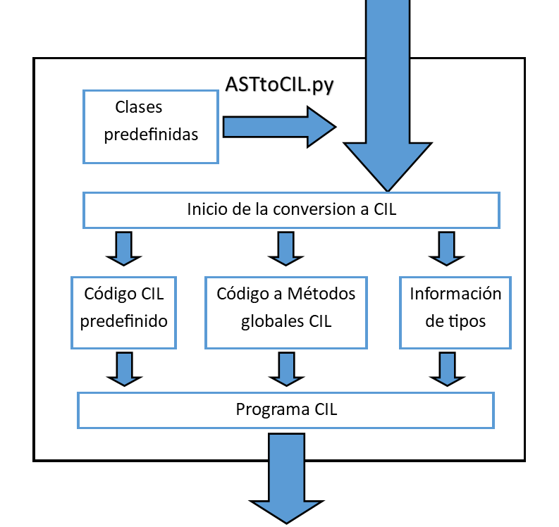
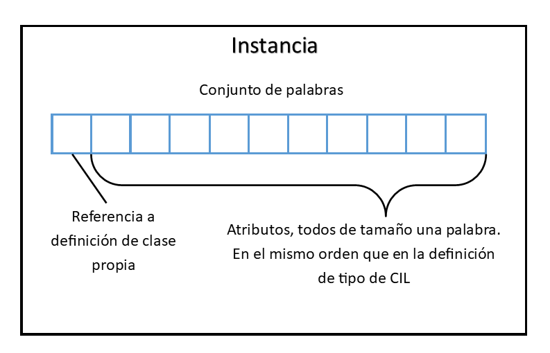
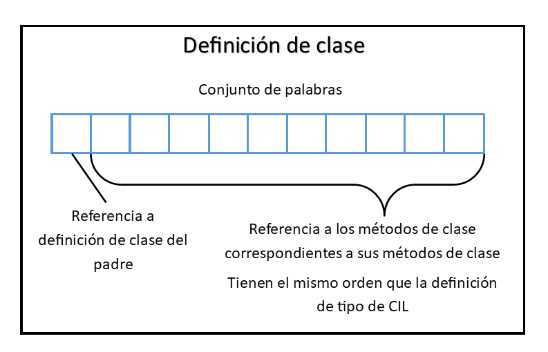
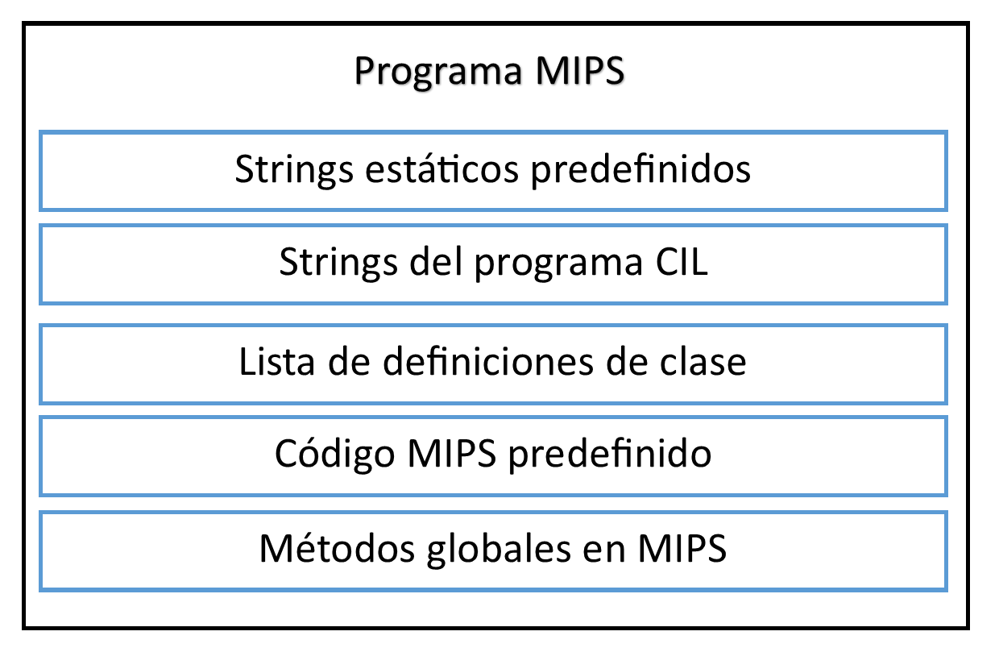

# Reporte sobre el desarrollo del compilador
En este reporte expondremos los requerimientos y forma de uso de nuestro compilador, además daremos un repaso sobre el diseño del mismo y sus distintas fases.
## Formas de uso y requeriminetos
Nuestro compilador fue desarrollado en el lenguaje **Python** y actualmente para ser usado solo necesita del uso de módulo **ply** del mismo.
Para ser ejecutado solo se debe dirigir a `\src` en nuetro proyecto y ejecutar `python TigerandButiCompiler.py {input}` donde _input_ sería la dirección del archivo a compilar, como resultado se obtendrá un archivo _.mips_ con el mismo nombre del archivo original que luego podrá ser ejecutado por `spim`, simulador de **MIPS**.
## Estructura del proyecto
La totalidad del mismo se halla en `\src` siendo *TigerandButiCompiler* nuestro archivo principal además de contener las definiciones del lexer y el parser y en _AST_ se define el AST generado por nuestro parser.   
Para la fase de chequeo semántico se creó *Semantics_Checking* donde se realiza el chequeo semántico, apoyándose en *Scope* donde se define el concepto de Scope y en *Cool_Type* donde se define el concepto de tipo de COOL además de definir los tipos básicos.  
En la fase de generación de código se adiconan bastantes nuevos elementos como *CIL* donde se define un AST para la versión de CIL utlizada en nuestro proceso de compilación, en *ASTtoCIL* se realiza el proceso de convertir nuestro, AST generado por el parser, en un nuevo AST de CIL y en *DefaultClasses* se definen las clases básicas de COOL como nodos del AST original para ser aprovechadas, además se definen algunos métodos útiles para convertir los llamados a métodos basicos en código MIPS. Luego en *CILtoMIPS* se realiza la conversión de nuestro AST de CIL en un código en MIPS, para hacerlo se apoyan en un Scope usado para este caso definido en *ScopeMIPS* y en el archivo *AssemblyMethods* dentro de `\StaticCode` donde se definen la mayor parte de de los métodos básicos en código MIPS.
## Fases de desarrollo
El proyecto fue dividido en disitintas fases para su implementación, estas fueron:
  1. Lexing
  2. Parsing
  3. Semantic Checking
  4. Code Generation  



A continuación daremos un resumen de como se desarrollaron las mismas así como algunas de las problemáticas principales que hallamos
### Lexing   
Para su realización se analiza el programa de izquierda a derecha donde las diferentes componentes son agrupadas en *tokens*, componente lexico básico que tiene un significado. Durante este proceso se elimina del programa toda información innecesaria, espacios y comentarios por ejemplo, por lo que se puede decir que en esta fase el *Lexer* transforma el programa de entrada en una secuencia de los ya mencionados *tokens*.   
Todo *token* obtenido como resultado de este proceso tendrá un lexema, string que lo identifica, y un tipo, string que define el tipo de *token* que es. Se definieron todas las palabras reservadas según las especificaciones del Manual de COOL primeramente y luego otros tipos como los string o identificadores de variables. El tipo y lexema de un *token* pueden coincidir o no; un ejemplo claro sería un string de **COOL** ya que su tipo seria `string` y su lexema puede ser cualquier string válido comparado con una palabra reservada del lenguaje, las cuales tienen un lexema fijo igual a su tipo.   
La construcción de este lexer se realiza mediante el uso de la ya mencionada herramienta PLY en su submódulo **lex**. Para lograrlo se deben definir los distintos tipos de tokens en una lista, en este caso una variable **tokens**; luego se debe realizar una definición de que secuencia de caracteres son aceptados por cada *token* mediante el uso de expresiones regulares, en este caso esto es realizado dentro de un método `t_{name}`, siendo **name** el nombre del token a definir debido a la convención de **lex**. Un ejemplo de ello sería:  
```python
def t_false(t):
    r'false'
    t.lexer.ty="Bool"
    return t
```
Es válido destacar que en el caso de los comentarios fue tomada la decisión de eliminarlos del texto del código en COOL mediante un preprocesamiento para hacer más facil nuestro trabajo.
### Parsing
La próxima fase sería el utilizar los *tokens* producidos y a partir de él construir un AST (árbol de sintaxis abstracta) del programa, quedando de esta forma validado el programa sintácticamente.  
El proceso sería el siguiente, luego de obtener todos los tokens de nuestro programa de COOL gracias a **lex** los mismos son pasados a el otro submódulo de **ply** llamado **yacc**, el cual usamos para realizar la implementación. En el mismo mediante una definicion de una gramática BNF (Backus-Naur Form), usando los tokens dados por el lexer usado anteriormente, se logra la creación de un AST para el programa en COOL.  
El proceso de definición de esta dependió sobre todo de los nodos definidos en el AST de COOL, mencionado antes, y de la gramática para programas válidos de COOL dada por nosotros.  
Para la creación de las distintas producciones de la gramática, usando la convención de **yacc**, se crea una función `p_{name}` siendo **name** el nombre de la producción. Esta función comenzaría con un dosctring en forma EBNF (Extended BNF) para definir la forma de la producción, en el caso de **yacc** se usa los dos puntos (:) para separar el símbolo inicial de la producción del resto de la misma. Luego en el cuerpo de la función se definen los pasos que se necesiten para construir el o los nodos del AST que sean convenientes. Para acceder a los distintas partes de la producción se indexa sobre el parámetro de la producción (en el caso de **yacc** es usado comúnmente **p**) a partir de 1 y el resultado de la producción se guarda en 0. Además de guardan en los nodos del AST las posiciones en línea y columna de los mismos para posteriormente ser usados en el señalamiento de errores. Un ejemplo de ello sería lo siguiente:
```python
def p_conditional(p):
    '''conditional : if expression then expression else expression fi'''
    p[0] = ConditionalNode(predicate = p[2], then_body = p[4], else_body = p[6])
    (linea,columna) = posicion(p)
    p[0].index = columna
    p[0].line = linea
    pass
```
Con todo esto listo **yacc** genera un parser shift_reduce LALR(1) para nuestra gramática, Vale aclarar que a pesar de no poderse cubrir todo tipo de gramáticas mediante un parser de este tipo se realizaron ligeros cambios a la gramática que aparece en el Manual de COOL para lograr desambiguarla para este tipo de parser, con lo cual se obutvo la que se usa actualmente en nuestro programa.   
Uno de los procesos mas engorrosos fueron los llamados a los distintos tipos de Dispatch ya que estos poseen varias definiciones según la forma en que se llame. Otra problemática que tuvimos fue debido al orden en que debía quedar el AST, debido a la ambigüedad existente en la gramática de **COOL** en el manual, lo cual se solucionó mediante la declaración de la precedencia entre distintos operadores.  
Es bueno destacar que en aras de optimizar un poco el algoritmo y código generado se decidió preoperar las operaciones artiméticas o de comparación en que solo participen constantes enteras para lograr hacer un poco mas simple nuestro árbol y con ello el código final generado. Además se hizo un análisis de los métodos a los que se les realiza Dispatch para podar luego los que jamás son utilizados.
### Semantic Checking
En esta fase se desea asegurar el cumplimiento de los predicados semánticos definidos en el lenguaje, por lo cual se va a reunir informacón sobre el programa mediante el uso de distintos algoritmos y estructuras.    
Debido la conveniencia del AST obtenido en la fase anterior el mismo es recorrido por nosotros para realizar este chequeo, este proceso se realiza mediante el uso del patrón **visitor**, potente herramienta que permite abstraer el recorrido de las acciones a realizar, con el cual comenzando desde el primer nodo del AST devuelto por **yacc**, se puede ir recorriendo la totalidad de estos.   
Para usar este patrón se define una clase `Semantic_Checker` en la cual aparecen varios métodos auxiliares y se encuentran definidos los distintos métodos que utilizan el patrón para recorrer el árbol. Durante todo este proceso de recorrido se van guardando las clases, variables, atributos y métodos mediante el concepto de `Scope`, las cuales se actualizan durante el recorrido del mismo, exceptuando el caso de las clases que son guardadas al inicio del recorrido. Además se utiliza a la clase `Cool_Type` para guardar información sobre los clases y definir algunos métodos auxiliares necesarios para el desarrollo de este proceso.   
Por cada nodo del AST, en que se vea necesario, se intenta inferir un tipo estático el cual es guardado en el mismo y devuelto hacia su nodo padre para que sea utilizado por él en su propio chequeo. Los errores que pueden levantarse en este proceso han sido definidos según el Manual de COOL para lograr su correcta implementación.   
Una problemática a destacar fue el caso de hallar las clases con herencia cíclica, este proceso se realiza al comienzo del chequeo tratando de por cada nodo de clase, en estado 0 de no haber sido definido anteriormente, llegar a un antecesor común ya definido (estado 2), al comienzo este será Object, para luego definirse, si durante esta búsqueda se topa con un nodo que también está en medio del proceso (estado 1) significa que existe un ciclo por lo cual se devuelve un error. Ahora un diagrama en que se ve un estado intermedio de este proceso comenzando desde la clase C.   
  
Como se puede apreciar al comenzar se chequea que la clase C esta en el estado inicial 0, por lo que se pasa a chequear su antecesor directo y se cambia su estado a 1, en este caso A. Al estar A también en el estado 0 este pasa a estado 1 y se procede a revisar a su padre Object, al estar Object en estado 2 entonces se vuelve a A el cual pasa a estado 2 y de este a C que también pasa a estado 2. La clase B se mantiene todo el tiempo en estado 0 en este caso ya que no pertenece a los ancestros de A. Como ya se mencionó, un error durante este proceso sería que durante el proceso de revisar a los antecesores se tope con una clase en estado 1 lo cual sería imposible a menos que estemos en un ciclo por lo cual se lanza el error.  

### Codegen
Usando el AST que ya pasó por el semántico y con cierta información de tipos estáticos agregada procedemos a la generación de código intermedio que más tarde se utilizará para producir código MIPS; todo mediante el uso del patrón visitor.

#### CIL
Los componentes del lenguaje CIL son bastante simples. Se encuentra integrado por:
* Instrucciones de a lo sumo dos operadores y un destino.
* Definición de Strings como Data:
* Definición de métodos como globales, que contienen las instrucciones, una lista de parámetros y de variables locales.

* Definición de clases con un mapeo de sus nombres de métodos a los globales, así como definición de sus atributos. En esta definición se incluyen elementos que le pertenecen a su padre antes de los propios, conservando el orden en que se encuentran en el padre. Vale la pena mencionar en que el orden de los métodos y atributos definidos en su padre conservan el mismo orden y son los primeros.

* Programa CIL, que contiene todo lo anterior.


La lista de instrucciones CIL se adjunta a continuación:
* CILTypeCheck: Usado en los case
* CILBinaryOperator: Que incluye a los operadores aritméticos y de comparación
* CILUnaryOperator: Incluye el complemento y el is void
* CILLabel: Para usar en los ciclos y condicionales como dirección destino de los saltos
* CILJump y CILConditionalJump: Usados para los saltos
* CILAllocate: Usado al crearse un nuevo objeto
* CILArgument: Usado para pasar parámetros a un método. Después de esta instrucción solo puede venir una del mismo tipo o una llamada a un método.
* CILCall y CILVirtualCall: El primero realiza una llamada normal y el segundo recibe un tipo y realiza la llamada asumiendo dicho tipo.
* CILStringLoad: Utilizada para cargar strings predefinidos.
* Instrucciones específicas: Instrucciones utilizadas en las clases base, como leer y escribir de la entrada estándar y manipulación de strings.

Para lograr la conversión se agregan las clases por defecto y luego se ordenan las clases de forma que todo elemento siempre aparecerá antes que su hijo; lo que permitirá al analizar una clase ya haber analizado a sus ancestros. Seguidamente se mapean los métodos de clase a métodos globales que se poblarán más tarde. Ya en este paso se recopila la información de la clase que será utilizada en la **CILClass**.


Por cada clase predefinida se le agrega a sus métodos globales el código CIL ya predefinido. Luego por cada clase se agrega su método **$init**, utilizado en la creación de instancias para asignarle valores a los atributos con valores ya definidos; en dicho método se llama al equivalente de su padre en caso de tenerlo, para luego evaluar sus propias expresiones. Por cada método de clase se realiza la transformación de sus nodos a instrucciones CIL que luego se guardan encapsuladas en un método global. En todo momento se sigue la política de que en el destino de la última instrucción contiene el resultado de la expresión analizada, incluyendo los mismos métodos. Aquí se omiten los métodos que se haya detectado desde el parser que nunca serán usados.

La información anteriormente obtenida permite formar un Programa CIL, que constituye la salida de esta parte del programa.

#### MIPS
Dado el programa CIL se lleva a una transformación a MIPS.  
Una parte importante para entender la estructura es la representación de las instancias de clase. Toda instancia se guarda como una referencia a un conjunto de palabras, de las cuales la primera siempre es una referencia a su definición de clase y el resto son los atributos. Una variable que contenga una instancia en realidad lo que contendrá será una referencia a esta.


##### Valores void
Para representar los valores void se le da de valor a la referencia a una instancia en un inicio el valor 0, por lo que saber si es void puede ser tan simple como preguntar si es igual a 0 la referencia a instancia.

##### Qué es la definición de clase?
Se puede observar al inicio del programa con la forma *Nombreclase: .word Padreclase, f1, f2...*, que no es más que una ubicación en el heap donde se encuentra guardada la direccion de la definicion de su clase padre, seguida por las direcciones de sus métodos. Es el descriptor de los elementos estáticos de una clase es decir su padre y sus métodos.


##### Llamada a un método
La llamada a los métodos tiene un indicador de la posición relativa a su definición de clase. Dependiendo del caso se busca la definición de clase a través de su referencia en la instancia y luego se llama al método, o se obtiene la definición de clase destino a través de un VirtualCall; Ya una vez con la definición de clase correcta se llama al método en la posición indicada. Por esta razón es que se insiste en el orden de los métodos en las clases.

##### Trabajo con los atributos
Los atributos como se sabe residen en la instancia y por lo tanto para acceder a ellos simplemente se necesita su posición en esta. En ellos también se cumple el orden anteriormente expuesto para garantizar coherencia en los llamados.

##### Estructura del programa
* Strings predefinidos
* Strings del programa CIL
* Definiciones de clase
* Código MIPS predefinido
* Métodos globales del programa en MIPS


#### Uso de registros
* Registros $a#: Se usan para pasarle parámetros a los métodos en el interior de los métodos se evita su uso y en caso de necesitar usarlos, primero se guardan en la pila para luego restaurarlos. El único caso en que se modifican es si es especificado por el código CIL recibido.
* Registros $s#: Se deben salvar antes de utilizarlos, para luego restaurarlos. No tienen reservada una función específica
* Registros $t#: No necesitan ser salvados antes de utilizarlos. Internamente se utilizan en casi cada conversión a MIPS como lugar donde se cargan los parámetros CIL de la instrucción origen
* Registro $v0: No necesita ser salvado en sus operaciones.Se utiliza para el valor de retorno de las funciones, así como de destino intermedio en la conversión a MIPS. $v1 no se usa
El resto de los registros tiene una función asignada por el estándar de MIPS que no se violó. nos referimos a $ra, $sp, etc.  
Alguna regla se violó en el código predefinido, debido a que solo se usa en circunstancias específicas y basado en el modelo de programación seguido
  
#### Tipos en tiempo de ejecución
Esto proviene de un tipo CIL que pide inferencia de tipos. Lo que se utiliza es la definición de clase. Se pregunta si tu definición de clase, a la que se puede acceder desde la instancia es la buscada, en caso de no serlo se compara con la del padre, y sucesivamente con la de su padre; si en estos casos se encuentra una respuesta afirmativa se retorna verdadero. En caso de ver que llegaste a una clase sin padre(Object), es decir padre igual a 0, se retorna falso.

#### Helpers
A destacar son dos funciones utilizadas constantemente en la conversión a MIPS que fueron de gran utilidad. Una que se ocupa dado los parámetros de la instrucción CIL cargarlos en los registros $t# y otra que se ocupa dado el resultado en $v0 guardarlo. Lo importante de estos métodos es que son capaces de discernir si un parámetro es parámetro del método, variable local, número, etc y manejar los datos acorde, lo cual facilitó bastante el trabajo de conversión.